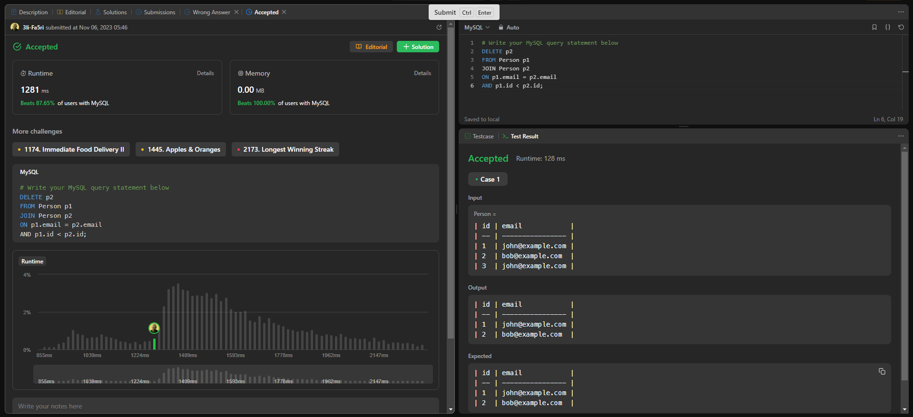

[196. Delete Duplicate Emails](https://leetcode.com/problems/delete-duplicate-emails/)

Table: `Person`

```sql
+-------------+---------+
| Column Name | Type    |
+-------------+---------+
| id          | int     |
| email       | varchar |
+-------------+---------+
```

id is the primary key (column with unique values) for this table.
Each row of this table contains an email. The emails will not contain uppercase letters.

Write a solution to **delete** all duplicate emails, keeping only one unique email with the smallest `id`.

For SQL users, please note that you are supposed to write a `DELETE` statement and not a `SELECT` one.

For Pandas users, please note that you are supposed to modify `Person` in place.

After running your script, the answer shown is the `Person` table. The driver will first compile and run your piece of code and then show the `Person` table. The final order of the `Person` table **does not matter**.

The result format is in the following example.

**Example 1:**

**Input:**
Person table:

```sql
+----+------------------+
| id | email            |
+----+------------------+
| 1  | john@example.com |
| 2  | bob@example.com  |
| 3  | john@example.com |
+----+------------------+
```

**Output:**

```sql
+----+------------------+
| id | email            |
+----+------------------+
| 1  | john@example.com |
| 2  | bob@example.com  |
+----+------------------+
```

**Explanation:** john@example.com is repeated two times. We keep the row with the smallest Id = 1.


